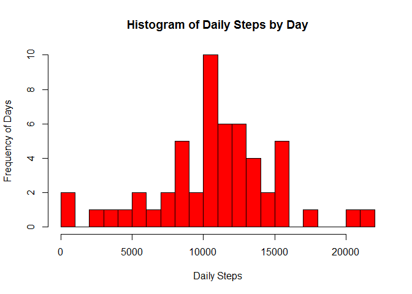
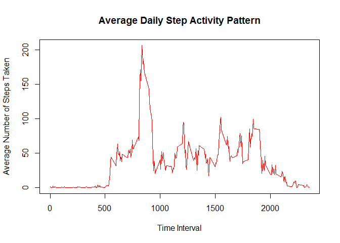
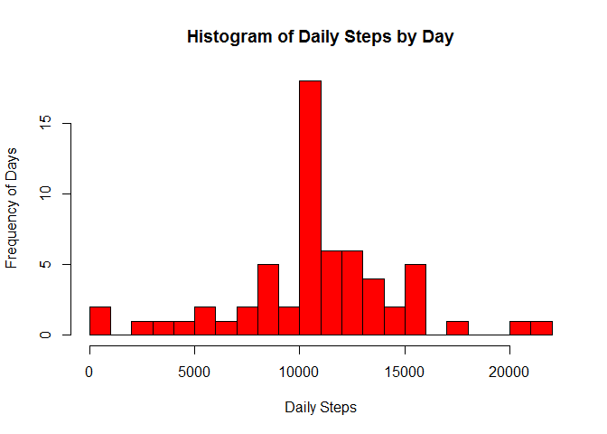
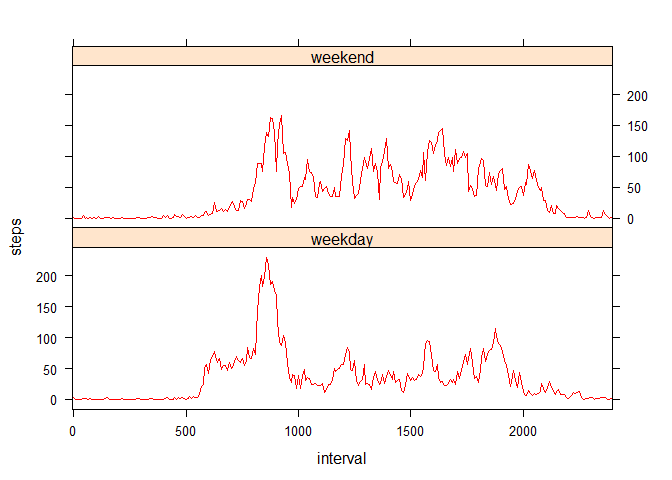

# Reproducible Research: Peer Assessment 1

## Loading and preprocessing the data

* Set up knitr options


```r
require(knitr)
```

```
## Loading required package: knitr
```

```r
opts_chunk$set(cache.path = "cache/", fig.path = "figure/" )
```


* Load libraries, unzip file and read in CSV file


```r
library(stringr)
library(lubridate)
library(lattice)

# Assume that the activity.zip is in the folder
# Unzip

unzip("activity.zip")

# Read data

data <- read.csv("activity.csv")
data$interval <- as.factor(data$interval)
```

* Dataset is now ready for processing


```r
str(data)
```

```
## 'data.frame':	17568 obs. of  3 variables:
##  $ steps   : int  NA NA NA NA NA NA NA NA NA NA ...
##  $ date    : Factor w/ 61 levels "2012-10-01","2012-10-02",..: 1 1 1 1 1 1 1 1 1 1 ...
##  $ interval: Factor w/ 288 levels "0","5","10","15",..: 1 2 3 4 5 6 7 8 9 10 ...
```

```r
head(data)
```

```
##   steps       date interval
## 1    NA 2012-10-01        0
## 2    NA 2012-10-01        5
## 3    NA 2012-10-01       10
## 4    NA 2012-10-01       15
## 5    NA 2012-10-01       20
## 6    NA 2012-10-01       25
```


## What is mean total number of steps taken per day?

* Aggregate the steps data by date


```r
dailySteps <- aggregate(steps ~ date, data, sum, na.action = na.omit)
```

* Generate histogram of the daily steps by date


```r
hist(dailySteps[, 2], breaks = 25, col = "red", 
     main = "Histogram of Daily Steps by Day", 
     xlab = "Daily Steps", ylab = "Frequency of Days")
```

 

* Calculate the mean and median steps in the dataset


```r
meanSteps <- as.character(round(mean(dailySteps[,2]), digits=2))
medianSteps <- as.character(round(median(dailySteps[,2]), digits=2))
```

The mean total number of steps per day is 10766.19 and the median total 
number of steps is 10765.

## What is the average daily activity pattern?

* Group daily activity pattern, create a plot of the 5 minute interval (x-axis) 
and average the number of steps taken across all days


```r
intervals <- levels(data$interval)
intervalSteps <- aggregate(steps ~ interval, data, mean, na.action = na.omit)

plot(intervals, intervalSteps[,2], type = "l", 
     main= "Average Daily Step Activity Pattern", xlab = "Time Interval", 
     ylab = "Average Number of Steps Taken", col = "red")
```

 

* Calculate the 5 minute interval which, on average, contains the maximum number 
of steps


```r
max <- which(intervalSteps[,2]== max(intervalSteps[,2]))
maxInterval <- intervalSteps[max,1]

# Add in colon to make interval appear like a time

first <- str_sub(maxInterval,1,1)
last <- str_sub(maxInterval,2,3)
maxInterval <- paste0("0", first, ":", last)
```

The 08:35 interval contains the maximum number of steps on average 
across all the days in the dataset.

## Imputing missing values

* Count the number of NAs


```r
# is.na gives a logical vector, so we can count NAs with sum
NAs <- is.na(data$steps)
numNA <- sum(NAs)
```

There are 2304 NAs in the dataset.

* In the dataset, if there are any NAs in a day, all values for that day are NA
* Replace NAs with the mean value for that interval by mapping to an average day


```r
# Get the NA rows in data$steps
NAs <- which(NAs)
#Get the number of days with NAs in the dataset
NADays <- length(NAs)/length(intervalSteps[,2])

# Create new dataset 
newData <- data

#with intervalSteps repeated by the number of NADays
newData$steps[NAs] <- rep(intervalSteps[,2], NADays)
```

* Generate histogram of the total number of steps taken each day in the new 
dataset


```r
dailyStepsNew <- aggregate(steps ~ date, newData, sum, na.action = na.omit)

hist(dailyStepsNew[, 2], breaks = 25, col = "red", 
     main = "Histogram of Daily Steps by Day", 
     xlab = "Daily Steps", ylab = "Frequency of Days")
```

 

* Calculate the mean and median steps in the new dataset


```r
meanStepsNew <- as.character(round(mean(dailyStepsNew[,2]), digits=2))
medianStepsNew <- as.character(round(median(dailyStepsNew[,2]), digits = 2))
```

The mean total number of steps per day is 10766.19 and the median total
number of steps is 10766.19.

The median steps value has now become the mean steps value, while the histogram
of the fequency of days emphasises the peak. 

By replacing the NAs with the means of the intervals, it has replaced all those 
values with an "average"" day, making the median peak more prominent, bringing 
the mean into alignment which fits with what would be expected.

## Are there differences in activity patterns between weekdays and weekends?

* Generate weekend/weekday data


```r
# Add new weekday variable to newData data frame
# NB - wday==1 is Sunday and wday == 7 is Saturday

newData$weekday <- "weekday"
newData$weekday[wday(as.Date(newData$date))==1|
                  wday(as.Date(newData$date))==7] <- "weekend"
newData$weekday <- as.factor(newData$weekday)

# Create plotData data frame
plotData <- aggregate(steps ~ interval + weekday, newData, mean)
```

* Generate panel graph comparison between weekend and weekday
using the lattice library


```r
# Use xyplot to plot steps against interval split by weekday
# Use custom panel function to control output
# For scales, there are 288 intervals with 12 in an hour
# Splitting on every 60 gives 5 hour intervals as per the labels

xyplot(steps ~ interval | weekday, data = plotData,  layout = c(1,2),
       scales=list(x=list(at=seq(1,288,60), 
                  labels=c(seq(0,2500,500)))),
       panel = function(x,y) {
         panel.xyplot(x, y, lty=1, cex = 1, type = "l", col="red")
      })
```

 

By aggregating by weekday and weekend, it is possible to see that, on average,
there are significantly more steps during the weekend daytime, than during the
week. 

This would fit with what might be expected, since during the week, people often
work in an office, limiting their walking time.
